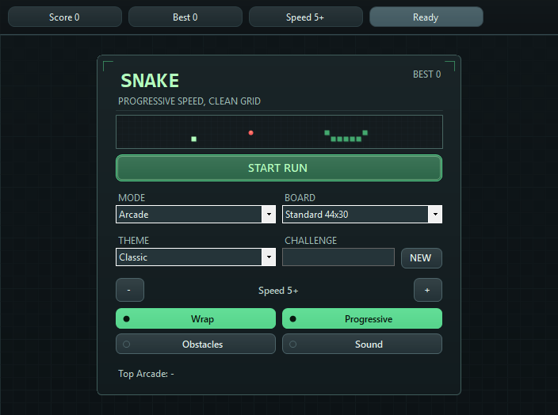
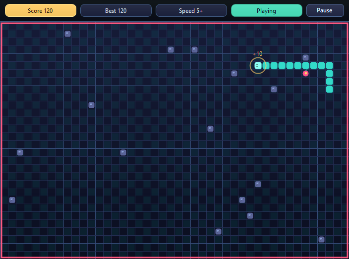
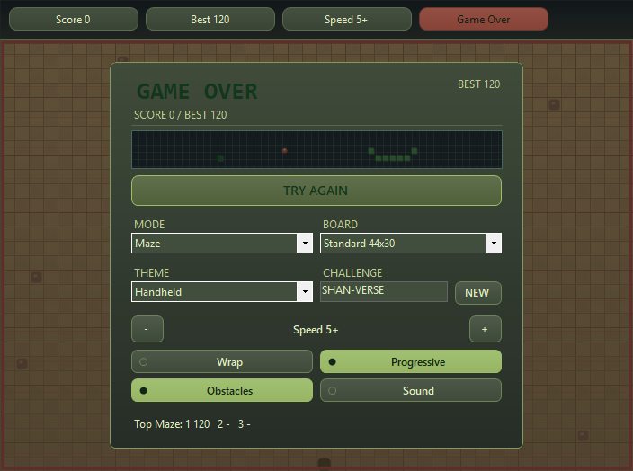

# SnakeGame

A Windows Snake game with five ways to play, four visual themes, and repeatable challenges. Pick a preset, chase the next food, and beat your own local best.

Built with **C# · Windows Forms · .NET Framework 4.7.2**.



## Play

1. Open [Windows Build](https://github.com/huiishan99/game-csharp-snake/actions/workflows/windows-build.yml) and choose a successful run for `main`.
2. Download its `SnakeGame-Windows-Release-<version>-<sha>` artifact. GitHub requires you to sign in to download Actions artifacts, and old artifacts may expire.
3. Extract the download and the packaged ZIP inside it. Keep `SnakeGame.exe` and `SnakeGame.exe.config` together, then run the executable on Windows with **.NET Framework 4.7.2 or later**.
4. Choose a mode and press **Enter** or **START RUN**. A short countdown gives you time to get ready.

This is a Windows desktop app, not a browser game. The package includes `BUILD_INFO.txt` so you can identify exactly which commit you are playing.

## Controls

| Action | Control |
| --- | --- |
| Steer | Arrow keys or **W A S D** |
| Pause / resume | **Space** or the on-screen button |
| Start / restart | **Enter** or the start button |
| Change starting speed | **− / +**, Left / Right, or the menu buttons |

Eat food to grow and earn **10 points**. Avoid your own body. With solid walls enabled, hitting an edge ends the run; with wrapping enabled, you reappear on the opposite side. Obstacles are also fatal. Fill every available cell to win.

## Find your pace

| Preset | Starting speed | Rules |
| --- | --- | --- |
| **Classic** | 5 | Wrap around edges, fixed pace, no obstacles |
| **Arcade** | 5 | Wrap around edges, speed increases as you score |
| **Maze** | 5 | Solid walls, obstacles, increasing speed |
| **Speed Run** | 8 | A faster start, solid walls, increasing speed |
| **Zen** | 3 | Slower, fixed pace with wrapping and no obstacles |

Presets are starting points: adjust the speed from **1–10**, wrapping, progressive speed, obstacles and sound before a run. The board and window size lock during play so resizing cannot change the rules mid-run.



## Make it yours

- **Three boards:** Compact 36×28, Standard 44×30, or Wide 56×30
- **Four themes:** Classic, Neon, Handheld, and Soft, including matching menus, HUD, snake and board
- **Repeatable challenges:** enter a seed or press **NEW**. The same seed with the same board and obstacle settings reproduces the starting food and obstacle layout
- **Local records:** a best score and top five scores per mode, saved on your computer
- **Remembered preferences:** mode, board, theme, speed, challenge seed, wall rules, progressive speed, obstacles and sound
- **Small touches:** animated menu preview, start/resume countdowns, score flashes, food feedback and optional short sounds

Leaderboards are local and grouped by mode. Custom settings and board sizes can differ between entries; they are personal records rather than an online competitive ranking.



## Build from source

Use Windows with Visual Studio 2022 and the **.NET desktop development** workload, including the .NET Framework 4.7.2 targeting pack. Open `SnakeGame.sln`, build `Release`, and start the `SnakeGame` project.

Or use a Visual Studio Developer PowerShell:

```powershell
msbuild SnakeGame.sln /p:Configuration=Release /m
.\SnakeGame.Tests\bin\Release\SnakeGame.Tests.exe
.\bin\Release\SnakeGame.exe
```

The app uses custom Windows Forms controls and `System.Drawing` rendering. `GameEngine.cs` contains the game rules separately from the form; presets, speed, seeded challenges and leaderboards have their own classes. Player data uses .NET application settings.

## Verification and screenshots

`Windows Build` builds the Release solution, runs **22 rule-level checks**, exercises the real Windows Forms UI, and uploads both a playable package and a runtime evidence artifact.

The automated UI smoke launches and closes the standalone executable, then covers presets, board sizes, a live movement timer, countdowns, scored gameplay, pause/resume, collision/restart, seed replay, and settings/leaderboard reload. It loads the production game form from the Release executable; deterministic play drives the existing key and timer handlers. Screenshots are actual Windows desktop captures, not mockups or generated artwork.

This does not replace human keyboard/play-feel testing, listening to audio, or checking other DPI/display configurations. See [screenshot provenance and runtime results](docs/screenshots/README.md), the [Windows testing guide](docs/WINDOWS_TESTING.md), and the [release checklist](docs/RELEASE_CHECKLIST.md).

Development history: [DEVLOG.md](DEVLOG.md).
